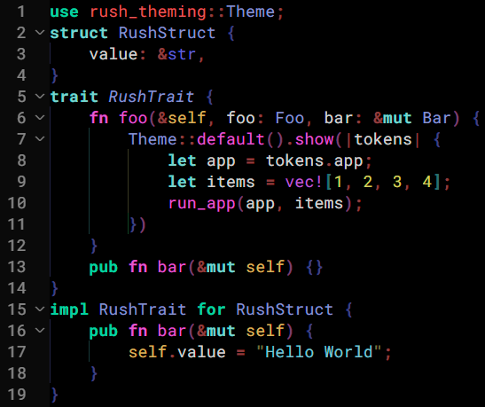

# Rush Synthwave
Theme with synthwave-inspired colors. Focus more on the code. Matches well with languages.

Divided tokens into two classes of brightness: *Normal* and *Dimmed* to give more focus to the *Normal* code.

It is recommended to activate *Bracket Pair Colorization* and *Bracket Pair Guides* in the settings, and use *Error Lens* extension, when using the theme.

## Goals

- Match well with any language.
- Make it dark: Do not tire eyes.
- Get focus with brightness.

## Supported Languages

Tokens of this theme may match the language *completely* or *less*. Some may need to install extension. Some good-matched popular languages are given below:

- Javascript
- Typescript
- Python
- Java
- C#
- C
- C++
- Rust
- Assembly
- Php
- Ruby
- Go
- Swift
- Dart
- Julia
- Scala

## Also see

[Rush Forest](https://marketplace.visualstudio.com/items?itemName=SeanRush.rush-forest)

## __Don't forget to leave a comment! Issue me any suggestion, color or error!____

